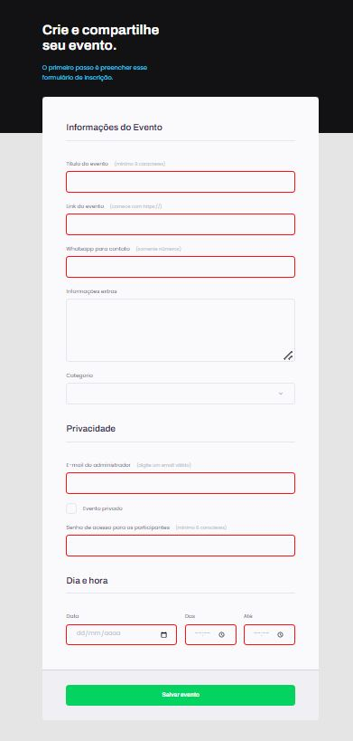

<h1 align="center"> Formulário para eventos </h1>

Formulário para criação de eventos. 

  <a href="#-tecnologias">Tecnologias</a>&nbsp;&nbsp;&nbsp;|&nbsp;&nbsp;&nbsp;
  <a href="#-projeto">Projeto</a>&nbsp;&nbsp;&nbsp;|&nbsp;&nbsp;&nbsp;
  <a href="#-layout">Layout</a>&nbsp;&nbsp;&nbsp;

 

  

## 🚀 Tecnologias

Esse projeto foi desenvolvido com as seguintes tecnologias:

- HTML e CSS
- Git e Github
- Figma

## 💻 Projeto

Este é um formulário para criação de eventos online ou presenciais.

- [Visite o projeto online](https://pcbandeira-m.github.io/explorer-projeto03)

## 🔖 Layout

Você pode visualizar o layout do projeto através [DESSE LINK](https://www.figma.com/file/DaWcjB3tg6H77DsdPdFVbt/Explorer-Stage-03-Projeto-01-Copy?fuid=1196998376984740990). É necessário ter conta no [Figma](https://figma.com) para acessá-lo.
